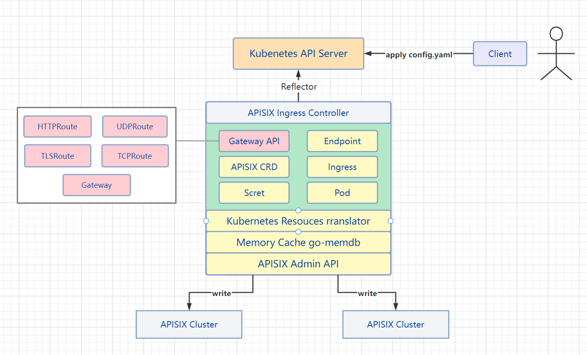

# 支持 Gateway API 中的 TCPRoute

- [需求详情](#需求详情)
  - [需求背景](#需求背景)
  - [Gateway API](#gateway-api)
  - [TCPRoute](#tcproute)
- [技术方案](#技术方案)
- [实现梳理](#实现梳理)
- [规划](#规划)

## 需求详情

### 项目介绍

[apisix-ingress-controller](https://github.com/apache/apisix-ingress-controller) 是 Apache APISIX 控制平面组件。它是通过使用ApisixRoute、ApisixUpstream、Ingress 等进行声明性配置并发送到 Kubernetes ，所有这些资源都将被监视并转换为 Apache APISIX 中相应的配置。

项目技术栈：

* APISIX 需要对该网关有一定的了解。
* kubernets 使用 k8s 作为基础设施做二次开发。
* Golang 需要使用 client-go 实现 `Ingress Controller`。

### 需求背景

**背景**：[issues #644](https://github.com/apache/apisix-ingress-controller/issues/644).

**需求**：支持 Gateway API 资源，需要实现 TCPRoute 资源对 APISIX TCP 代理配置的转换能力。

### Gateway API

Gateway API 旨在通过提供表现性的、可扩展的、面向角色的接口来改善服务网络，这些接口由许多厂商实现，并得到了业界的广泛支持，相比较 Ingress ，它具有一下特点：

**更具表现力**

Gateway 表达了更多的核心功能，比如基于头的匹配、流量加权和其他功能，而这些功能在 Ingress 中只能通过自定义方式实现。

**更具扩展性**

Gateway API 允许在 API 的各个层次上链接自定义资源。这就允许在 API 结构的适当位置进行更精细的定制。

**面向角色**

它们被分离成不同的 API 资源，这些资源映射到 Kubernetes 上运行应用程序的常见角色。

**跨命名空间**

跨越不同 Namespaces 的路由可以绑定到网关。

**更具扩展性**

Gateway API 允许在 API 的各个层次上链接自定义资源。这就允许在 API 结构的适当位置进行更精细的定制。

**基于这些特点，所以 apisix-ingress-controller 应该支持它。**

### TCPRoute

Gateway API 设计原则主要能应用于多种协议，而 TCPRoute 就是负责管理 TCP 流量的路由，监视 bakends 端口，并能够作为 VIP 将流量转发到对应的 backends，本次项目主要实现 Gateway API 中的 TCPRoute 资源，并将资源转换到 APISIX 当中，从而开启 APISIX 的 TCP 流量治理能力。

## 技术方案

Gateway API 是一个 API 资源的集合 —— Service、GatewayClass、Gateway、HTTPRoute、TCPRoute 等。对于每一种资源需要实现对应的 Controller 来负责对该类资源进行 watch ，当资源变更时，做出相应的处理（将资源转换到 APISIX）。  

* 实现 `TCPRouteController` 负责持续关注 TCPRoute 资源的变化，当资源发生变化时将相关的操作同步到 APISIX ，先写 APISIX，再写 Cache。
* 完成资源对 APISIX TCP 代理能力的转换，并写入。

**架构图：**



## 实现梳理

Gateway API 作为一个API 资源的集合，在本次项目中我们只需要实现 TCPRoute ，该项目[apisix-ingress-controller](https://github.com/apache/apisix-ingress-controller)已实现了 Gateway 可参考对应的实现逻辑。

* 实现控制器 `TCPRouteController`，使用 `Reflector` 监控（Watch）Kubernetes API Server 的 TCPRoute 资源，当监控的资源发生变化时，触发相应的变更事件，并通过 `Informer` 为 TCPRoute 注册变更事件的回调函数，如`Add` `Update` `Delete`等。当资源变更时，回调函数会把资源的 `key` 放到 `workqueue` 中，控制器中的多个 `work` 协程负责从 `workqueue` 取出事件做相应的逻辑处理：
  * TCPRoute 资源到协议的转换
  * 写缓存加速访问
  * 写 APISIX
* 实现 TCPRoute 资源到 APISIX 协议的转换函数，TCPRoute 资源版本为 `v1alpha2`，需要转换到 `APISIX` TCP 协议配置，需要解析出 Service 的IP Port 写入 APISIX 中的 upstream ，从而实现 TCP 流量治理能力。

1. 通过以下配置，使 Gateway 9100 端口上的所有 TCP 流量都转发到 `tcp-service` Kubernetes Service 的 8080 端口上。

```yaml
apiVersion: gateway.networking.k8s.io/v1alpha2
kind: Gateway
metadata:
  name: tcp-gateway
spec:
  gatewayClassName: tcp-gateway-class
  listeners:
  - name: foo
    protocol: TCP
    port: 9100
    allowedRoutes:
      kinds:
      - kind: TCPRoute
---
apiVersion: gateway.networking.k8s.io/v1alpha2
kind: TCPRoute
metadata:
  name: tcp-app
spec:
  parentRefs:
  - name: tcp-route
    sectionName: foo
  rules:
  - backendRefs:
    - name: tcp-service
      port: 8080
```

2. 步骤 1 中所转换成对应 APISIX 的配置。（只是大概，并不完全正确）

```json
{
    "remote_addr": "127.0.0.1:9100",
    "upstream": {
        "nodes": {
            "*.*.*.*:8080": 1
        },
        "type": "roundrobin"
    }
}
```

## 产出规划

|  时间       |   开发任务                                                                                              |
|  ----       | ------------------------------------------------------------------------------------------------------ |
|  6/16-6/30  | 查阅 `Gateway v1alph2` 资源概念和版本资料，参考其他项目的相关设计，确认 APISIX TCP 代理能力的配置规则。最后确定实现方案  |
|  7/01-7/20  | 完成 TCPRoute 控制器的基本能力，以及资源的转换规则。                                                       |
|  7/21-7/31  | 完成 TCPRoute e2e 的测试用例。                                                                          |
|  8/01-8/10  | 进行 review 更改，确保鲁棒性并符合项目规范和预期需求，并进行项目结尾工作。                                   |